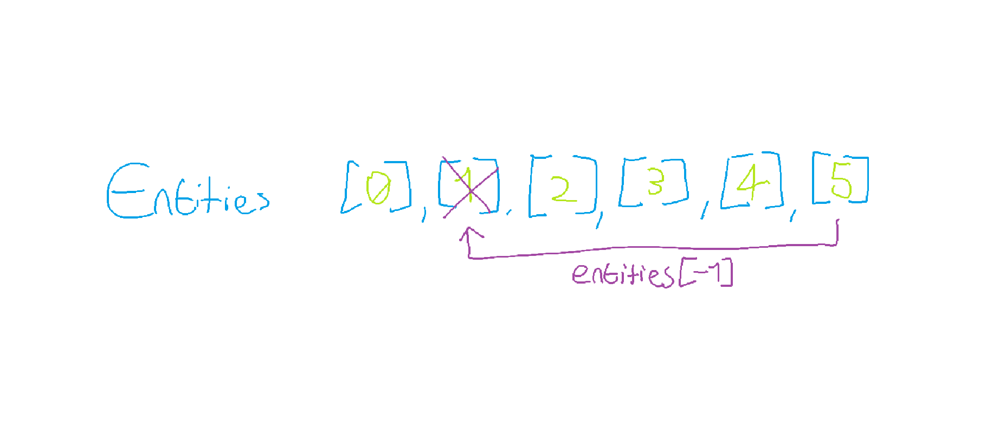

# Roguelike Game
This is a simple work-in-progress roguelike game written in C. The game will feature a procedurally generated dungeon, basic combat mechanics, and a variety of items and enemies to encounter.

## Architecture
The game is structured around a few core systems: Entity Management, Rendering, Input Handling, and Game Logic. Each system is designed to be modular and independent, allowing for easy maintenance and future expansion.

### Entity Management
For our entities, we keep them all in a single dynamically allocated flat array. This allows us to keep all of our entities in a contiguous block of memory that expands as required, which is much more cache-friendly and efficient for updates. This avoids the pointer chasing and cache misses that would happen each frame if we gave them a consistent memory address, especially as we spawn and despawn more entities.

When an entity is removed, we swap it with the last entity in the array ([-1]) and then reduce the size of the array by one. This way, we can keep all of our entities packed together without leaving gaps in memory. When we need more space for new entities, we can simply realloc the array to a larger size.

This however gives us another challenge. When we perform a swap and compact, or we call realloc because we need more space, entities change their memory address. If other systems are holding pointers to those entities, we need a way to update those pointers to the new memory address.

To do this, I will eventually implement watchers. Entities will track who is watching them, and using callbacks, they will notify their watchers when they are moved or removed. Currently this is NOT implemented.

### World Generation

## Building
To build the project, you will need gcc and make installed on your system. Once you have those, you can run the following commands:

`make` - This will compile the source code and create an executable named `roguelike`.  
`make clean` - This will remove the compiled executable and any object files, allowing you to start fresh.  
`make run` - This will compile the code (if it hasn't been compiled already) and then run the `roguelike` executable.
